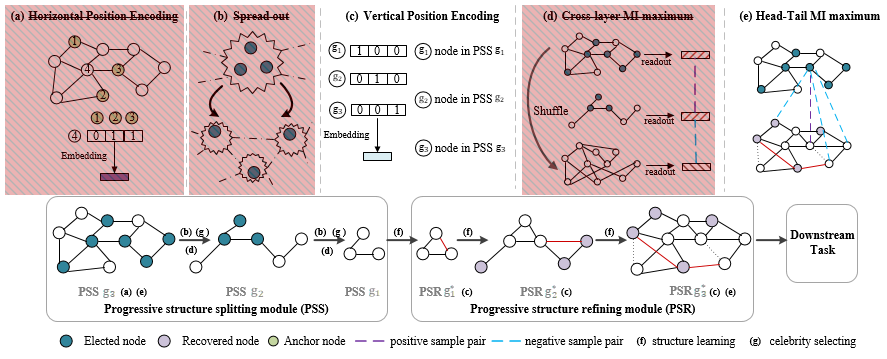

# PROSE: Graph Structure Learning via **Pro**gressive **S**trat**e**gy

## Update
[Reviewer 9JfK](https://openreview.net/forum?id=qgjMCSkhRff&noteId=qq09SQpx-a) points out that our method is very complicated with many heuristic designs and losses, which may make it less efficient and hard to reproduce.

We agree with the above viewpoint. And we also believe that the more cumbersome the method, the worse its robustness and generalization. Therefore, recently we have slightly modified the network structure to simplify the proposed method, and discarded several auxiliary components, including horizontal node position embedding,  cross-gradation MI maximum loss and spread out operation loss. ***Finally, the improved model does appear more concise, but it still achieves similar performances as reported in the paper***.

#### The Simplified PROSE (The components coverd by the light red box has been removed!)


## Introduction
This is an **improved** implementation of the paper "PROSE: Graph Structure Learning via Progressive Strategy. Huizhao Wang, Yao Fu, Tao Yu, Linghui Hu, Weihao Jiang, Shiliang Pu. KDD 2023."

Note that, the code provided by this repository is slightly inconsistent with the original description in the paper, since we have removed the redundant code implementations of the discarded auxiliary componets. If the above situation has caused you confusion, we apologize for it.


## Requirements
This code requires the following:
* Python==3.7
* networkx==2.5
* numpy==1.19.2
* scikit_learn==1.0.2
* scipy==1.6.1
* torch==1.8.1


## Usage for Citeseer and Pubmed

### Run the PROSE model on Citeseer
* cd into the 'PROSE_citeseer' folder
* run the PORSE model and report the performance

    ```
         python main.py
    ``` 
Note that the newly added parameter `add_embedding` is important as it enables better optimization of the progressive structural splitting module, which can be roughly understood as a residual network.

### Run the PROSE model on Pubmed
* cd into the 'PROSE_pubmed' folder
* run the PORSE model and report the performance

    ```
         python main.py
    ```

## License

This project is released under the [Apache 2.0 license](./LICENSE). Other codes from open source repository follows the original distributive licenses.

## Acknowledgement
This implementation is mainly based on [SUBLIME](https://github.com/GRAND-Lab/SUBLIME),[IDGL](https://github.com/hugochan/IDGL) and [Graph U-Nets](https://github.com/HongyangGao/Graph-U-Nets). We thank the authors for their great jobs!
